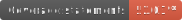
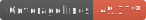
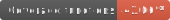
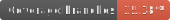

# Dot Matrix Gen

Dot matrix gen is a simple way to replicate animations like the classic
Tamagochi or Rakuraku Dinokun that can be exported as a simple vector of
matrix. You can create a frame by frame animation using the editor and
play to check the end result of animation.

The main goal for this project is to be a tool to be used at another one, so
it's updated as needed;

